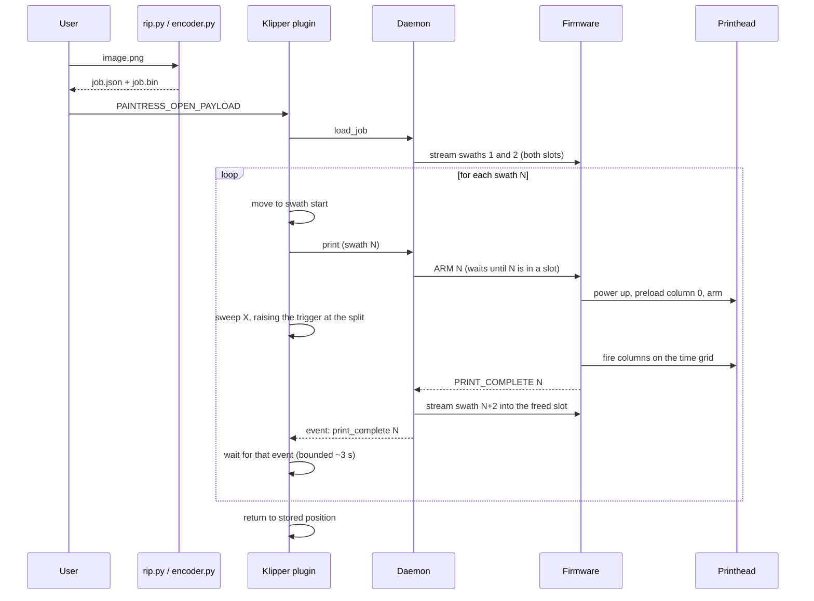

# Anatomy of a print

This page follows a print from an image file to ink on the substrate. For the
modules and files involved, see [System architecture](../architecture.md).

## 1. Offline: RIP and encode

`rip.py` converts the image to ink channels, applies tone compensation,
halftones each channel and divides the result into passes. It writes a RIP
payload (`.json` + `.bin`). `encoder.py` reads the head layout from that
payload, compensates for nozzle-column offsets and packs the data into
147-byte lines. The resulting job is another `.json` + `.bin` pair. See [RIP
and halftoning](rip-and-halftoning.md) and
[File formats](../reference/file-formats.md).

## 2. Load

`PAINTRESS_OPEN_PAYLOAD` asks the daemon to load the job. The daemon checks
the format version, index consistency and two fingerprints: the frame must
match the firmware, and the head must match the daemon's `--head` setting.
This host-side head check is necessary because the board cannot detect the
fitted printhead.

The daemon starts filling the firmware's two PSRAM slots to reduce the wait
before printing. Meanwhile, the plugin calculates bounds from the payload size
or Klipper's `exclude_object` polygons. It derives the firing interval from
DPI and print speed and includes it in every `print` command.

## 3. The swath loop

For each swath, the plugin:

1. **Moves** the head to the start of the travel rectangle in X and the pass's
   scheduled Y position.

2. **Arms** the swath. The daemon waits until its data is in a slot, then
   sends `ARM`. The firmware sets up the head and waits for the trigger.

3. **Sweeps** X at print speed. At `trigger_distance`, the motion MCU raises
   the trigger with `SET_PIN`. The two colinear moves keep the head moving
   through the split. The firmware starts its fixed firing grid on that edge.
   See [Firing and timing](firing-and-timing.md).

4. **Confirms** completion. After the sweep, the plugin waits up to about 3 s
   for the swath's `print_complete` event. It polls in short intervals and
   checks status if the wait expires without an event. A missing trigger or
   firmware fault is reported on the affected swath, including the last one.

During the swath loop, the daemon fills each freed slot with the next swath,
allowing data transfer and printing to overlap. See [Double
buffering](double-buffering.md).

## 4. Completion and failure

After the last swath the plugin returns the toolhead to its stored position.

On failure, the plugin aborts the firmware. `ABORT` immediately disables the
DAC, and the daemon follows with a reset. The plugin then returns the head to
its stored position. Once recovery succeeds, the job can be retried from its
first swath without reloading it. See
[Troubleshooting](../guide/troubleshooting.md).